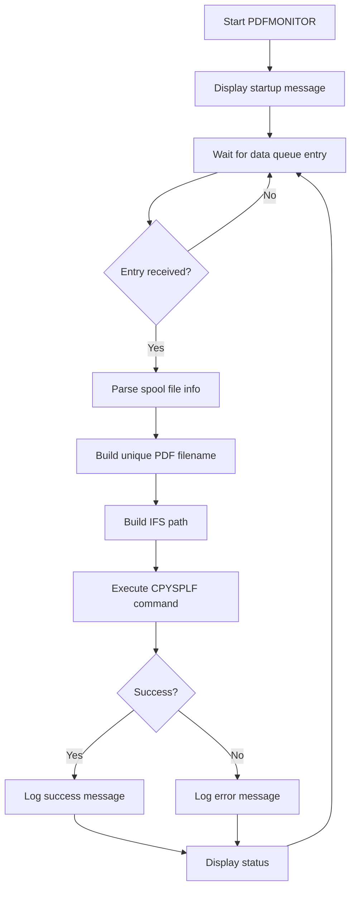

# PDF Monitor Program Plan

## Overview
Create an SQLRPGLE program ([`PDFMONITOR.SQLRPGLE`](PDFMONITOR.SQLRPGLE:1)) that continuously monitors the PDFOUTQ data queue and automatically converts spool files to PDF format, saving them to the IFS.

## Architecture

### Data Queue Setup
- **Output Queue**: PDFOUTQ (already exists)
- **Data Queue**: PDFOUTQ (already attached to output queue)
- **Data Queue Entry Format**: Standard IBM i spool file notification format (30 bytes)
  - Job Name: CHAR(10)
  - User Name: CHAR(10)  
  - Job Number: CHAR(6)
  - Spool File Name: CHAR(10)
  - Spool File Number: PACKED(4,0)

### Program Flow

### Key Components

#### 1. API Prototypes
- **QRCVDTAQ**: Receive data queue entry
  - Parameters: Queue name, library, data length, buffer, wait time
  - Wait time: -1 (infinite wait)
  
- **QMHSNDPM**: Send program message
  - Used for logging to job log
  - Message types: *INFO (success), *DIAG (errors)

#### 2. Data Structures
- **dtaqEntry**: Receives spool file information from data queue
  - Maps to the 30-byte data queue entry format

#### 3. Main Processing Logic
1. Initialize with infinite wait on data queue
2. When entry received:
   - Extract spool file details
   - Generate timestamp-based unique filename
   - Format: `SPLNAME_JOBNAME_JOBNBR_SPLNBR_TIMESTAMP.pdf`
   - Build full IFS path: `/home/pdf/filename.pdf`
3. Convert using CPYSPLF command via QCMDEXC
4. Log result to job log
5. Display status message
6. Return to wait state

#### 4. PDF Conversion
Uses CPYSPLF command with parameters:
- FILE: Spool file name
- TOFILE: *TOSTMF (stream file)
- JOB: Job number/user/name
- SPLNBR: Spool file number
- TOSTMF: IFS path for PDF
- WSCST: *PDF (workstation customization for PDF format)

### Configuration

| Setting | Value | Configurable |
|---------|-------|--------------|
| Data Queue Name | PDFOUTQ | No (hardcoded) |
| Data Queue Library | *LIBL | No (uses library list) |
| PDF Output Directory | /home/pdf | Yes (variable) |
| Wait Time | -1 (infinite) | Yes (variable) |
| Filename Format | SPLNAME_JOB_TIMESTAMP.pdf | Yes (code change) |

### Error Handling

1. **Data Queue Errors**: Program will wait indefinitely; timeout only on attention key
2. **CPYSPLF Errors**: Caught via monitor block, logged to job log
3. **SQL Errors**: Captured via SQLCODE, displayed and logged
4. **IFS Errors**: Captured if directory doesn't exist or permissions issue

### Logging

- **Success Messages**: Written to job log as *INFO messages
- **Error Messages**: Written to job log as *DIAG messages
- **Display Messages**: Output to job via DSPLY for interactive monitoring
- **Log Format**: "PDF created: /full/path/to/file.pdf" or "PDF conversion failed: reason"

### Deployment Steps

1. Create `/home/pdf` directory on IFS (or modify `ifsFolder` variable)
2. Compile program: `CRTSQLRPGI OBJ(PDFMONITOR) SRCFILE(QRPGLESRC)`
3. Submit to batch: `SBMJOB CMD(CALL PDFMONITOR) JOB(PDFMON)`
4. Monitor: Check job log and display messages
5. End: Send attention key or end job

### Enhancement Opportunities

1. **Configuration File**: Read PDF directory from external config
2. **Database Logging**: Log all conversions to audit table
3. **Email Notifications**: Send email with PDF attachment
4. **Retention Policy**: Auto-archive or delete old PDFs
5. **Multiple Queues**: Monitor multiple data queues
6. **Error Recovery**: Retry failed conversions
7. **Performance**: Process multiple entries in parallel (multi-threading)

### Testing

1. **Test 1**: Create test spool file and add to PDFOUTQ
2. **Test 2**: Verify PDF created in /home/pdf directory
3. **Test 3**: Verify unique filenames for multiple spool files
4. **Test 4**: Test error handling with invalid spool file
5. **Test 5**: Verify job log messages
6. **Test 6**: Test program end via attention key

### Security Considerations

- Program runs under authority of submitted user
- IFS directory permissions must allow write access
- Spool file authority checked by CPYSPLF command
- Data queue read authority required

### Performance Notes

- **Wait State**: Program uses minimal CPU while waiting for data queue
- **Processing Time**: Depends on spool file size; typically 1-5 seconds per file
- **Throughput**: Sequential processing; one spool file at a time
- **Scalability**: For high volume, consider multiple job instances
