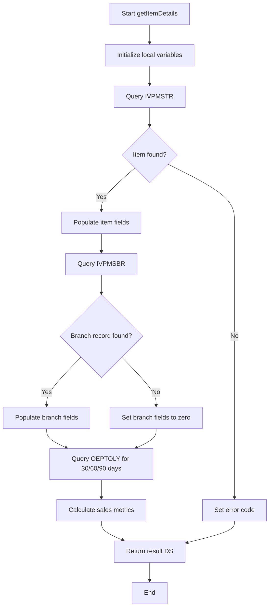

# ITEMDET Service Program Architecture

## Overview
Creating an external procedure service program following the PERZIP style to retrieve detailed item information from multiple tables.

## Analysis of PERZIP Style Pattern

Based on the PERZIP examples, the coding style includes:

1. **Copy Book (_CP)**: Contains the data structure definition and procedure prototype
2. **Service Program (.SQLRPGLE)**: NOMAIN module with:
   - `Ctl-Opt NoMain` declaration
   - Export procedure matching the prototype
   - Helper procedures for processing logic
   - SQL operations using embedded SQL
   - Monitor/On-Error blocks for error handling
3. **Testing Program (_TS)**: Simple RPGLE program that:
   - Includes the copy book with `/COPY`
   - Initializes test data
   - Calls the service procedure
   - Displays results

## File Structure

### Files to Create

1. [`QRPGLESRC/itemdet_cp.rpgle`](QRPGLESRC/itemdet_cp.rpgle) - ✓ Already exists with data structure
2. [`QRPGLESRC/itemdet.sqlrpgle`](QRPGLESRC/itemdet.sqlrpgle) - Main service program (needs to be created)
3. [`QRPGLESRC/itemdet_ts.rpgle`](QRPGLESRC/itemdet_ts.rpgle) - Test program (needs to be created)

## Data Structure Design

The [`ItemDetailDS`](QRPGLESRC/itemdet_cp.rpgle:23) data structure is already defined with:

### Input Fields
- `inItemNumber` - Item number to query
- `inBranch` - Branch code for branch-specific data

### Output Fields - Item Master (IVPMSTR)
- Item identification and description
- Item type, class, UOM
- Status, prices, cost, weight
- Creation and update dates

### Output Fields - Branch Item (IVPMSBR)
- Branch-specific quantities
- Reorder information
- Receipt and issue dates
- Branch status

### Output Fields - Sales History (OEPTOLY)
- 30/60/90 day sales amounts
- 30/60/90 day quantities sold
- Average sale prices
- Last sale date

### Control Fields
- `errorCode` - Error code for exception handling
- `errorMessage` - Descriptive error message
- `recordsFound` - Flag indicating if data was found

## Database Tables

### IVPMSTR - Item Master Table
- **Key Field**: ITEM#
- **Pending**: Need actual field names from DSPFFD
- **Purpose**: Core item information

### IVPMSBR - Branch Item Master Table
- **Key Fields**: ITEM#, BRANCH#
- **Pending**: Need actual field names from DSPFFD
- **Purpose**: Branch-specific inventory and status

### OEPTOLY - Sales History Table
- **Key Fields**: ITEM#, BRANCH#, INVDATE
- **Pending**: Need actual field names from DSPFFD
- **Purpose**: Historical sales transactions for calculating 30/60/90 day metrics

## SQL Query Design

### Query 1: Item Master
```sql
SELECT [field_list]
FROM IVPMSTR
WHERE ITEM# = :inItemNumber
```

### Query 2: Branch Item Master
```sql
SELECT [field_list]
FROM IVPMSBR
WHERE ITEM# = :inItemNumber
  AND BRANCH# = :inBranch
```

### Query 3: Sales History (30 days)
```sql
SELECT SUM(SALESAMT) as SALES30, 
       SUM(QTYSHIPPED) as QTY30,
       AVG(CASE WHEN QTYSHIPPED > 0 
           THEN SALESAMT / QTYSHIPPED 
           ELSE 0 END) as AVGPRICE30
FROM OEPTOLY
WHERE ITEM# = :inItemNumber
  AND BRANCH# = :inBranch
  AND INVDATE >= CURRENT DATE - 30 DAYS
```

### Query 4: Sales History (60 days)
Similar to 30 days, with `- 60 DAYS`

### Query 5: Sales History (90 days)
Similar to 30 days, with `- 90 DAYS`

### Query 6: Last Sale Date
```sql
SELECT MAX(INVDATE) as LASTSALE
FROM OEPTOLY
WHERE ITEM# = :inItemNumber
  AND BRANCH# = :inBranch
```

## Procedure Structure

### Main Procedure: getItemDetails



### Helper Procedures (following PERZIP pattern)

1. **getItemMaster** - Query IVPMSTR table
2. **getBranchItem** - Query IVPMSBR table  
3. **getSalesHistory** - Query OEPTOLY and calculate metrics
4. **calculateSalesMetrics** - Process sales data for time periods

## Error Handling

Following the PERZIP pattern with Monitor/On-Error blocks:

- **Item not found**: Error code 'ITM', message 'Item not found in master file'
- **Branch not found**: Warning code 'BRN', continue with zeros
- **SQL error**: Error code 'SQL', include SQLCODE and SQLSTATE
- **No sales history**: Not an error, return zeros

## Testing Strategy

The test program [`itemdet_ts.rpgle`](QRPGLESRC/itemdet_ts.rpgle) will:

1. Initialize test data with known item/branch
2. Call [`getItemDetails()`](QRPGLESRC/itemdet_cp.rpgle:19)
3. Display returned values
4. Test error conditions

### Test Cases

1. **Valid item with branch data and sales**
   - Should return all populated fields
2. **Valid item but no branch data**
   - Should return item data, zeros for branch/sales
3. **Invalid item number**
   - Should return error code and message
4. **Valid item with no sales history**
   - Should return item/branch data, zeros for sales

## Build Commands

Once field names are provided, the build process will be:

```
CRTRPGMOD MODULE(library/ITEMDET) SRCFILE(QRPGLESRC) SRCMBR(ITEMDET) DBGVIEW(*SOURCE)
CRTSRVPGM SRVPGM(library/ITEMDET) MODULE(library/ITEMDET) EXPORT(*ALL)
CRTBNDRPG PGM(library/ITEMDET_TS) SRCFILE(QRPGLESRC) SRCMBR(ITEMDET_TS) DBGVIEW(*SOURCE)
```

## Next Steps - Waiting on Field Names

To complete the implementation, I need the actual field names from DSPFFD or SYSCOLUMNS for:

1. **IVPMSTR** fields for description, type, UOM, class, status, prices, cost, weight, dates
2. **IVPMSBR** fields for quantities, reorder info, dates, status
3. **OEPTOLY** fields for sales amounts and quantities

Once provided, the SQL queries can be completed and the service program can be fully implemented.

## Implementation Status

- [x] Copy book structure defined
- [ ] Service program implementation (waiting on field names)
- [ ] Test program creation (waiting on service program)
- [ ] Unit testing
- [ ] Integration with existing systems
