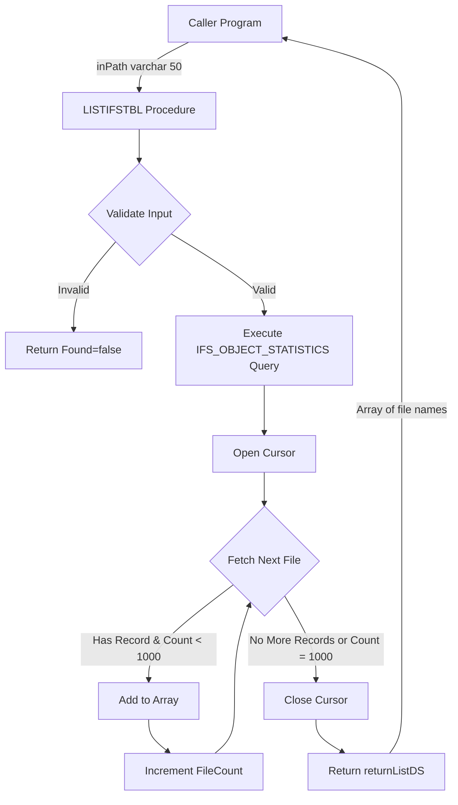

# IFS Table List Procedure Design

## Overview
External procedure to list files (tables) in an IFS directory path, returning an array of up to 1000 file names.

## Procedure Name
**LISTIFSTBL** (List IFS Tables)

## Purpose
Retrieves a list of file/table names from a specified IFS directory path, following the same patterns and standards as the existing [`GETITEM`](../QRPGLESRC/getitem.sqlrpgle:1) procedure.

## Parameters

### Input
- **inPath** - `varchar(50)` - IFS directory path to scan for files/tables

### Return
- **returnListDS** - Data structure containing:
  - **FileNames** - Array of `varchar(100)` with up to 1000 entries
  - **FileCount** - `packed(5:0)` - Number of files found (0-1000)
  - **Found** - `ind` - Indicator if any files were found

## Data Structures

### File Entry Structure (fileEntry_t)
```rpgle
dcl-ds fileEntry_t qualified template;
  FileName varchar(100);    // File/table name (no path)
end-ds;
```

### Return Data Structure (returnListDS)
```rpgle
dcl-ds returnListDS qualified;
  FileNames likeds(fileEntry_t) dim(1000);  // Array of file names
  FileCount packed(5:0);                    // Count of files found
  Found ind;                                // Success indicator
end-ds;
```

## SQL Query Strategy

### Using QSYS2.IFS_OBJECT_STATISTICS
This IBM i table function provides comprehensive IFS object information:

```sql
SELECT OBJECT_NAME
FROM TABLE(QSYS2.IFS_OBJECT_STATISTICS(
  START_PATH_NAME => :inPath,
  SUBTREE_DIRECTORIES => 'NO'
))
WHERE OBJECT_TYPE = '*STMF'  -- Stream files only
ORDER BY OBJECT_NAME
```

**Key Parameters:**
- `START_PATH_NAME` - Directory path to search
- `SUBTREE_DIRECTORIES => 'NO'` - Only search specified directory (not recursive)
- `OBJECT_TYPE = '*STMF'` - Filter for stream files (excludes directories)

## Implementation Approach

### 1. **Input Validation**
- Check if path parameter is empty
- Return error state if invalid

### 2. **Cursor-Based Processing**
Similar to [`GETITEM`](../QRPGLESRC/getitem.sqlrpgle:450)'s PO cursor pattern:
- Declare cursor with the IFS_OBJECT_STATISTICS query
- Open cursor
- Fetch records in a loop up to MAX_FILES (1000)
- Populate the array with file names
- Track count of files found
- Close cursor

### 3. **Error Handling**
- Handle empty directories (not an error, just return 0 files)
- Handle invalid paths (return Found = *off)
- Handle SQL errors gracefully

### 4. **Constants**
```rpgle
dcl-c MAX_FILES const(1000);  // Maximum files to return
```

## Files to Create

### 1. LISTIFSTBL.SQLRPGLE
Main service program file containing the external procedure implementation.

**Location:** `QRPGLESRC/LISTIFSTBL.SQLRPGLE`

**Structure:**
- Control options (NoMain, ExtBinInt, etc.)
- Copyright header with comprehensive documentation
- /copy statement for LISTIFSTBL_CP
- Main procedure implementation with export

### 2. LISTIFSTBL_CP.SQLRPGLE
Copy member containing data structures and prototypes.

**Location:** `QRPGLESRC/LISTIFSTBL_CP.SQLRPGLE`

**Contents:**
- fileEntry_t template structure
- returnListDS data structure definition
- LISTIFSTBL procedure prototype

## Example Usage

```rpgle
dcl-ds result likeds(returnListDS);

// List all files in /home/data directory
result = LISTIFSTBL('/home/data');

if result.Found;
  for i = 1 to result.FileCount;
    // Process each file name
    fileName = result.FileNames(i).FileName;
  endfor;
endif;
```

## Pattern Consistency with GETITEM

Following established patterns from [`GETITEM`](../QRPGLESRC/getitem.sqlrpgle:1):

1. **Service Program Structure**
   - Uses `Ctl-Opt NoMain` for service program
   - Same control options (SrcStmt, NoDebugIO, ExtBinInt, etc.)
   - External procedure with export keyword

2. **Copy Member Pattern**
   - Separate _CP file for data structures and prototypes
   - Template structures for array elements
   - Qualified data structures

3. **Cursor Processing**
   - Similar to [`GETITEM`](../QRPGLESRC/getitem.sqlrpgle:450)'s open PO cursor pattern
   - Loop with counter to limit results
   - Proper cursor open/fetch/close sequence

4. **Return Structure**
   - Main data structure with array
   - Count field tracking number of elements
   - Found indicator for success/failure

5. **Error Handling**
   - Check SQLCODE after operations
   - Return clear success/failure states
   - Safe cleanup in error conditions

## Architecture Diagram



## Testing Considerations

1. **Empty Directory** - Should return Found=true, FileCount=0
2. **Directory with Files** - Should return list of file names
3. **More than 1000 Files** - Should return first 1000 files
4. **Invalid Path** - Should return Found=false
5. **Non-existent Path** - Should return Found=false
6. **Path without Trailing Slash** - Should work correctly

## Benefits

1. **Reusable Component** - Can be called from any RPG program
2. **Efficient** - Uses IBM i system services for IFS navigation
3. **Consistent** - Follows established patterns in the codebase
4. **Safe** - Fixed array size prevents memory issues
5. **Clear** - Returns explicit success/failure indicators
