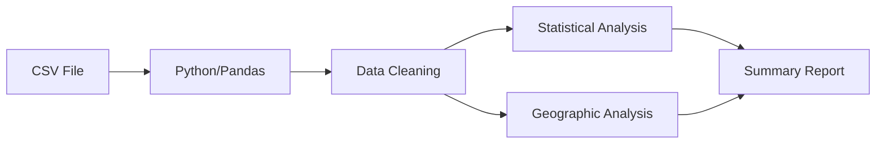
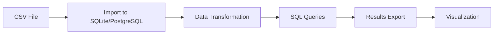
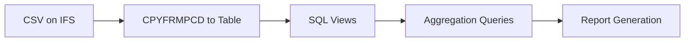

# October Less Fields CSV Analysis

## File Overview
- **Filename**: [`october_less_fields.csv`](../october_less_fields.csv:1)
- **Total Records**: 81,744 rows (including header)
- **Date Range**: October 1-31, 2025
- **Source**: Usage/transaction data export

## CSV Structure

### Fields
1. **USAGE_DATE** - Date in M/D/YYYY format (October 2025)
2. **OPERATION** - Type of operation performed
3. **DOCUMENT_ID** - Transaction/document identifier (scientific notation)
4. **DOC_REGIONS** - US state abbreviation or empty
5. **DOMESTIC_DOC_COUNT** - Binary flag (0 or 1)

### Sample Data
```
USAGE_DATE,OPERATION,DOCUMENT_ID,DOC_REGIONS,DOMESTIC_DOC_COUNT
10/1/2025,ResolveAddress,,,0
10/3/2025,SettleTransaction,9.80206E+13,SC,1
10/17/2025,VoidTransaction,9.80205E+13,NC,1
```

## Data Patterns Identified

### 1. Operation Types
Based on sampling across the file, the data contains:
- **ResolveAddress** - Address resolution operations (appears to dominate early records)
- **SettleTransaction** - Transaction settlement operations (most common overall)
- **VoidTransaction** - Transaction void/cancellation operations (rare)

### 2. Data Distribution by Section

#### Early Records (Lines 2-500)
- Operation: Almost exclusively `ResolveAddress`
- Document_ID: Empty
- DOC_REGIONS: Empty
- DOMESTIC_DOC_COUNT: All 0

#### Mid Records (Lines 10,000-10,500)
- Operation: Predominantly `SettleTransaction`
- Document_ID: Present (9.80205E+13 range)
- DOC_REGIONS: Valid state codes (NC, SC, VA, TN, GA, AL, MO, KY, MS)
- DOMESTIC_DOC_COUNT: All 1
- One `VoidTransaction` observed at line 10233

#### Later Records (Lines 40,000-40,500)
- Operation: Mix of `ResolveAddress` (lines 40000-40243) and `SettleTransaction` (40244+)
- Transition point around line 40244
- Additional states appear: FL, TX, CA, LA, MD
- DOMESTIC_DOC_COUNT: Mix of 0 and 1 values

#### Final Records (Lines 81,644-81,743)
- Operation: All `SettleTransaction`
- Document_ID: Present (9.80263E+13)
- DOC_REGIONS: Southeastern states primarily
- DOMESTIC_DOC_COUNT: All 1

### 3. Document ID Pattern
- Format: Scientific notation (e.g., 9.80206E+13)
- Actual values: ~980,200,000,000,000+ range
- Pattern suggests incrementing transaction/document identifiers
- IDs appear to increase over time within the month

### 4. Geographic Distribution
States identified in sample:
- **Primary**: NC, SC, VA, TN, GA (Southeastern US - highest frequency)
- **Secondary**: AL, MO, KY
- **Tertiary**: FL, TX, CA, LA, MS, MD, NJ
- Some CA, LA, MO entries marked with DOMESTIC_DOC_COUNT=0

### 5. Data Quality Issues

#### Issue: Empty Fields in ResolveAddress Records
- ResolveAddress operations have no DOCUMENT_ID or DOC_REGIONS
- Appears intentional (address lookups may not generate documents)

#### Issue: Scientific Notation for Document IDs
- Large numbers stored in scientific notation
- May cause precision loss when importing to Excel/other tools
- Actual value: ~14-digit numbers (likely timestamps or sequential IDs)

#### Issue: DOMESTIC_DOC_COUNT Inconsistency
- Most records with state codes have value=1
- Some CA, LA, MO, AL, KY, MD, TN records have value=0
- Possible international/out-of-scope transactions in those states?

#### Issue: Date Format Consistency
- Dates in M/D/YYYY format (e.g., "10/1/2025" not "10/01/2025")
- Single-digit days for dates 1-9
- May cause sorting issues without proper date parsing

## Key Findings

### Volume Estimates (Based on Sampling)
Approximate breakdown by operation type:
- **ResolveAddress**: ~30-40% of records (mostly front-loaded in time period)
- **SettleTransaction**: ~60-70% of records (continuous throughout month)
- **VoidTransaction**: <1% of records (very rare)

### Geographic Focus
- Strong concentration in Southeastern US states
- North Carolina (NC) appears most frequent
- Some non-domestic or out-of-region transactions (DOMESTIC_DOC_COUNT=0)

### Temporal Pattern
- File appears chronologically organized by USAGE_DATE
- Multiple operations per date
- ResolveAddress operations cluster at certain periods
- SettleTransaction operations more evenly distributed

## Data Quality Concerns

1. **Precision Loss Risk**: Document IDs in scientific notation need conversion to preserve full precision
2. **Null Handling**: Empty strings for DOCUMENT_ID and DOC_REGIONS in ResolveAddress records
3. **Inconsistent Domestic Flag**: Logic for DOMESTIC_DOC_COUNT=0 unclear for US states
4. **Date Format**: Non-ISO format may cause parsing issues in some systems

## Recommended Analysis Steps

### For Complete Analysis
1. Parse entire CSV with proper data types
2. Convert DOCUMENT_ID from scientific notation to full integer
3. Count operations by type and date
4. Analyze geographic distribution by state
5. Investigate DOMESTIC_DOC_COUNT=0 cases
6. Identify transaction patterns and anomalies
7. Calculate daily/weekly volume metrics

### Tools Needed
- Python with pandas for large dataset analysis
- SQL database for complex queries (optional)
- Data visualization tools for geographic mapping

### Specific Queries to Answer
- What percentage of transactions are ResolveAddress vs SettleTransaction?
- Which states have the highest transaction volume?
- What dates show unusual activity patterns?
- How many void transactions occurred and why?
- What is the meaning of DOMESTIC_DOC_COUNT=0 for US states?

## Architecture Recommendation

### Option 1: Python Analysis Script


### Option 2: Database Import + SQL Analysis


### Option 3: IBM i Native Analysis


## Next Steps

1. Clarify analysis objectives with stakeholder
2. Determine output format requirements
3. Choose analysis tool/platform
4. Implement full data parsing and analysis
5. Generate detailed statistics and visualizations
6. Document findings and recommendations
